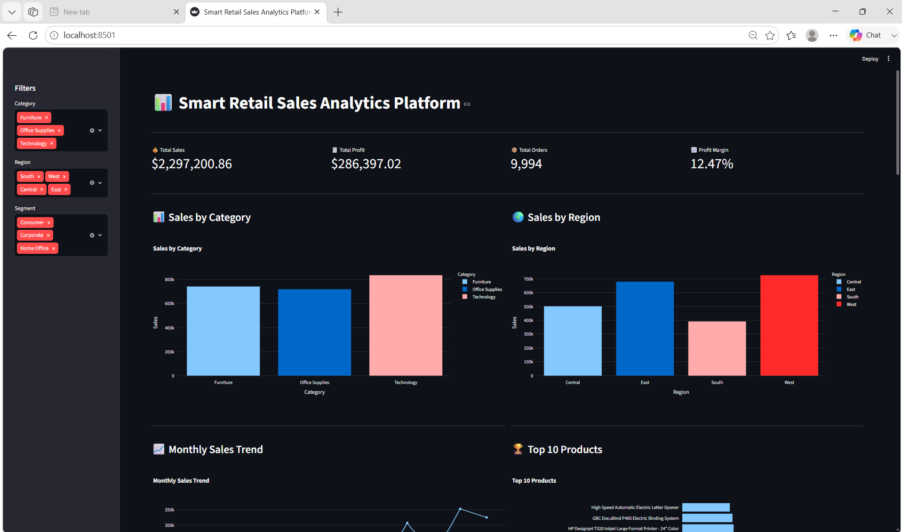
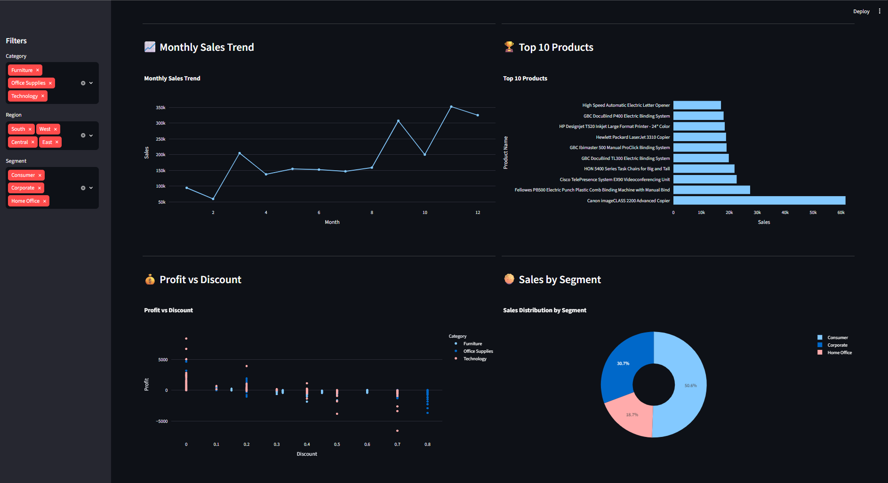
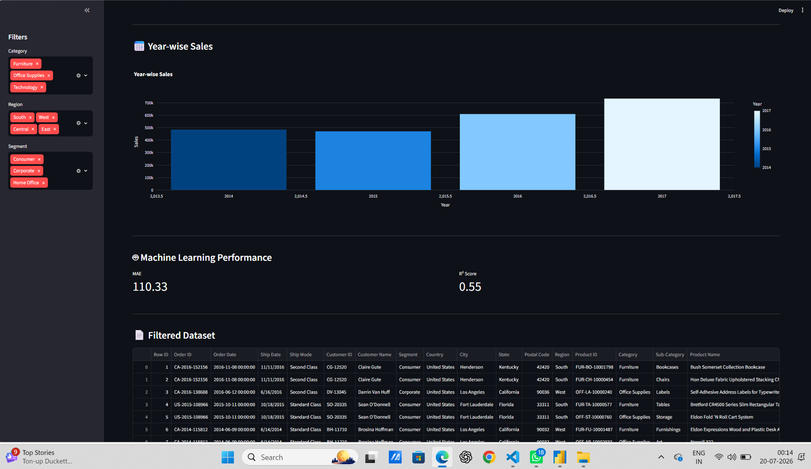
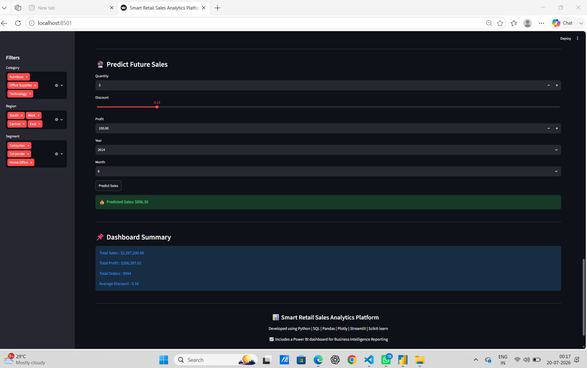
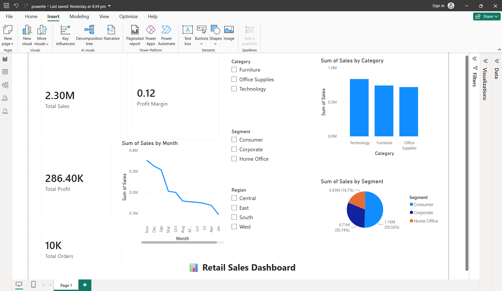

# 📊 Smart Retail Sales Analytics Platform

## 🔗 Live Demo
https://smart-retail-sales-analytics-platform-zub5m8r3kubqr8zjvxvelu.streamlit.app

## 🚀 Overview
An interactive retail sales analytics dashboard built using Python, SQL, Streamlit, Plotly, Scikit-learn, and Power BI. The project helps analyze sales performance, visualize business insights, and predict future sales using machine learning.

## ✨ Features
- 📈 Interactive KPI Dashboard
- 🔍 Dynamic Filters (Category, Region, Segment)
- 📊 Sales Analysis Charts
- 🤖 Sales Prediction using Random Forest
- 💾 SQL Database Integration
- 📥 CSV Download
- 📉 Power BI Dashboard for Business Intelligence

## 🛠️ Tech Stack
- Python
- SQL (SQLite)
- Pandas
- Plotly
- Streamlit
- Scikit-learn
- Power BI

## 📷 Dashboard Screenshots

### Streamlit Dashboard









### Power BI Dashboard



## Project Structure
```
Smart Retail Sales Analytics Platform
│── app.py
│── dashboard.py
│── database.py
│── preprocessing.py
│── retail.db
│── requirements.txt
│── dataset/
│── screenshots/
│── PowerBI/
```

## ▶️ Run the Project
```bash
pip install -r requirements.txt
streamlit run dashboard.py
```
